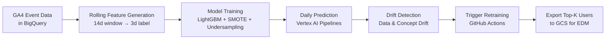

# 🎯 High Propensity Purchase Prediction System

An end-to-end MLOps system to identify high-intent users for e-commerce campaigns — built with Vertex AI Pipelines, automated drift detection, retraining, and integrated CI/CD deployment.

🔗 **Full project write-up**: [Medium Article](https://medium.com/@ansel-lin/from-model-to-deployment-building-an-automated-high-propensity-purchase-prediction-system-2aed17de9412)

---

## 🧠 Problem Statement

> 💡 _Who is this for?_  
> This repository is designed for product-oriented data scientists and ML engineers who want to build scalable, production-grade ML systems with integrated drift detection and automated retraining._

Traditional EDM segmentation often targets users based on simple heuristics or hot products. This leads to low conversion rates and wasted campaign budget.

This project solves that by:
- Predicting high-intent users using rich behavioral signals (GA4)
- Automating model lifecycle: training, prediction, drift detection, and retraining
- Enabling real-time EDM segmentation at global scale

---

## 📈 Business Impact
> 📊 _Why it matters_  
> Predictive targeting increased EDM campaign precision while reducing budget waste across 40+ global markets.

- Identifies **50+ high-intent users daily** across 40+ e-commerce sites
- Powers **real EDM campaigns**, improving targeting recall
- Serves as **an internal reference project** for predictive modeling & GenAI

---

## ⚙️ System Architecture
> 🧩 _Pipeline overview_  
> The system is built as a fully modular pipeline with scheduled jobs on Vertex AI. It automates prediction, monitoring, drift detection, and retraining.



---

## 🛠 Tech Stack

> Key tools & services powering this system

- **Cloud**: GCP Vertex AI Pipelines, BigQuery, GCS  
- **ML Frameworks**: LightGBM, CatBoost, XGBoost, SMOTE, Scikit-learn  
- **CI/CD**: GitHub Actions, YAML templating  
- **Monitoring**: Custom drift detection via statistical tests  
- **Visualization**: Matplotlib, seaborn (for offline evaluation)

---

## 🧪 Key Features & Techniques

This system was designed to be robust, modular, and business-aligned — with the following core capabilities:

- **Modular Pipeline Design**: Separated components for feature engineering, training, scoring, and drift detection
- **Rolling Window Labeling**: 14-day behavior window → 3-day intent prediction, built for temporal generalization
- **Data-Driven Retraining**: Drift-aware retraining mechanism based on BigQuery statistics, not fixed schedule
- **Business-Centric Metrics**: Evaluation optimized for Recall@TopK and campaign ROI, not just model loss
---

## 🔁 Auto-Retraining Architecture

This project implements **automatic retraining** triggered by **data or concept drift**.

- **Daily Drift Check**: A scheduled Vertex AI Pipeline evaluates data & concept drift from BigQuery.
- **Drift Detected**: If `drift_severity = "STRONG"` is detected, the pipeline triggers model retraining automatically using a templated training pipeline.
- **CI/CD Integration**: GitHub Actions is used only for **code updates** and **pipeline template deployment**. Daily operations are fully managed inside **Vertex AI Pipelines**.

> This architecture ensures retraining is **data-driven**, not time-driven, making the system more robust and cost-effective.

---

## 🗂 Repo Structure

```plaintext
high-propensity-prediction/
├── README.md                     
├── pipelines/                    
│   ├── training_pipeline.py
│   ├── predict_pipeline.py
│   ├── drift_pipeline.py
│   └── retrain_pipeline.py
├── components/                   
│   ├── train.py
│   ├── predict.py
│   ├── drift.py
│   └── retrain.py
├── scripts/                      
│   ├── compile_and_package.py
│   └── submit_pipeline_job.py
├── configs/                      
│   ├── schema.yaml               
│   └── thresholds.yaml           
└── docs/                                 
    └── decisions.md              

```

---

## 🔭 Roadmap

✅ Data Drift Detection — implemented and running on production  
✅ Concept Drift Detection — monitors feature-target relationship shifts  
✅ Auto-Retraining — powered by Vertex AI Pipelines & GitHub Actions  

🔄 Multi-Model Comparison & A/B Testing — experiment design in progress  
🔄 Uplift Modeling Extension — prototyping with synthetic campaign data  

**📄 For detailed design decisions, see [docs/decisions.md](docs/decisions.md)**  

---

## 👋 About Me

I’m [Ansel](https://www.linkedin.com/in/ansel-lin/), a Product-Focused Data Scientist building predictive systems, GenAI applications, and MLOps pipelines that drive real impact across global e-commerce products.

📩 Reach out via [Medium](https://medium.com/@ansel-lin) or [GitHub](https://github.com/ansel-lin-global) to collaborate.
